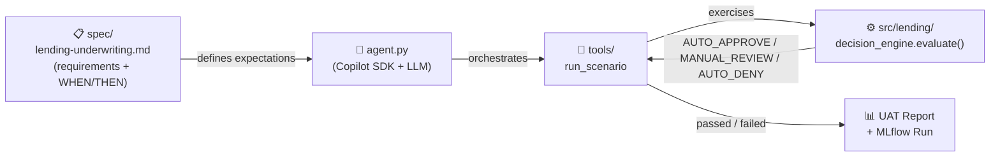

# FSI Lending Underwriting UAT Agent

Part of series of AI agents that automate code reviews, backlog refinement or software delivery workflows.

An AI agent that validates a **mortgage underwriting decision engine** against formal specifications.
It uses the **GitHub Copilot SDK** to orchestrate an LLM that generates synthetic loan applicants,
runs them through the decision engine, and compares outcomes against spec expectations — producing
structured UAT reports with pass/fail analysis and MLflow experiment tracking across model runs.



## Table of Contents

- [The Lending App](#the-lending-app-srclenging)
- [Quick Start](#quick-start)
- [Project Structure](#project-structure)
- [Test Scenarios](#test-scenarios)
- [Session Telemetry](#session-telemetry)
- [Development Notes](#development-notes)
- [CLI Reference](#cli-reference)
- [Usage Examples](#usage-examples)
- [Agent vs Manual Mode](#agent-vs-manual-mode)
- [Model Compatibility](#model-compatibility)
- [Troubleshooting](#troubleshooting)
- [Intentional Bugs (for UAT)](#intentional-bugs-for-uat)
- [Documentation](#documentation)

## The Lending App (`src/lending/`)

The system under test is a mortgage underwriting decision engine that takes a loan application and returns one of three outcomes: **AUTO_APPROVE**, **MANUAL_REVIEW**, or **AUTO_DENY**.

```
LoanApplication
  │
  ├─► Credit Check (credit.py)        Score tiers, adverse event windows
  │     fail → AUTO_DENY
  │
  ├─► Income Verification (income.py)  W2, self-employed, rental, pension, bonus
  │
  ├─► DTI Calculation (dti.py)         Back-end ratio + compensating factors
  │     >50% → AUTO_DENY
  │
  └─► Decision (decision_engine.py)    evaluate() → AUTO_APPROVE | MANUAL_REVIEW | AUTO_DENY
```

Domain models live in `models.py` as Python dataclasses. The agent exercises this engine by generating synthetic applicants, running them through `evaluate()`, and comparing outcomes against spec expectations.

## Quick Start

### Prerequisites

```bash
# 1. Create virtual environment and install dependencies
uv venv .venv
uv pip install -r requirements.txt --prerelease allow

# 2. Authenticate with GitHub (required for Copilot SDK) - i.e.
gh auth login
gh extension install github/gh-copilot  # if not already installed
```

> The Copilot SDK requires a GitHub account with an active Copilot subscription. See [copilot-sdk/authenticate-copilot-sdk/authenticate-copilot-sdk](https://docs.github.com/en/copilot/how-tos/copilot-sdk/authenticate-copilot-sdk/authenticate-copilot-sdk)

### Run

The agent runs UAT validation against the lending decision engine using an LLM to orchestrate test scenarios:

```bash
# Run UAT for all scenarios
uv run python agent.py --model claude-sonnet-4.5

# Run specific scenarios
uv run python agent.py --model claude-sonnet-4.5 -s standard_approval,bonus_income
```

## Project Structure

```
├── .github/
│   ├── skills/lending-underwriting/SKILL.md   # Skill definition with tool catalog and UAT scenarios
│   └── copilot-instructions.md                # Project context for Copilot IDE
├── spec/
│   └── lending-underwriting.md                # Single source of truth: full requirements + WHEN/THEN criteria
├── src/lending/                               # Decision engine implementation
│   ├── models.py                              # Domain models (LoanApplication, Income, Credit, etc.)
│   ├── income.py                              # Income verification logic
│   ├── dti.py                                 # DTI calculation with compensating factors
│   ├── credit.py                              # Credit assessment and adverse events
│   └── decision_engine.py                     # Main evaluate() entry point
├── tests/
│   ├── test_basic.py                          # Basic decision engine smoke tests
│   ├── test_tools.py                          # Unit tests for all tool functions (15 tests)
│   └── uat/reports/                           # Generated UAT reports
├── tools/                                     # Agent tool implementations
│   ├── run_scenario.py                        # Full scenario pipeline (generate → evaluate → compare)
│   ├── evaluate_application.py                # Run applicant through decision engine
│   ├── generate_synthetic_applicant.py        # Create test loan applications
│   ├── compare_decisions.py                   # Validate actual vs expected
│   ├── read_spec_rules.py                     # Parse spec requirements
│   └── generate_report.py                     # Produce markdown UAT reports
└── agent.py                                   # Copilot SDK entry point
```

### File Interdependencies

```
  ┌──────────────────────────────────────────────────────────────────┐
  │ IDE (VS Code Copilot extension)                                  │
  │   .github/copilot-instructions.md ──► project context for IDE    │
  └──────────────────────────────────────────────────────────────────┘

  ┌──────────────────────────────────────────────────────────────────┐
  │ agent.py  (uv run python agent.py)                               │
  │                                                                  │
  │  skill_directories=[".github/skills"]                            │
  │    └──► SKILL.md ──auto-loaded into every API call──► LLM        │
  │           │  contains: condensed spec + tool catalog             │
  │           │            + agent orchestration instructions        │
  │           │  instructs LLM to call read_spec_rules when needed   │
  │           ▼                                                      │
  │  tools/   (Python functions registered with SDK)                 │
  │    ├── run_scenario ─────────────────────────────────► src/      │
  │    ├── evaluate_application ────────────────────────► src/       │
  │    ├── generate_synthetic_applicant                              │
  │    ├── compare_decisions                                         │
  │    ├── generate_report                                           │
  │    └── read_spec_rules ──on-demand──► spec/lending-underwriting  │
  │                                        .md (full WHEN/THEN spec) │
  └──────────────────────────────────────────────────────────────────┘

  ┌──────────────────────────────────────────────────────────────────┐
  │ tests/test_tools.py                                              │
  │   read_spec_rules('spec/lending-underwriting.md') ──────────────►│
  │   spec/lending-underwriting.md  ◄── single source of truth       │
  └──────────────────────────────────────────────────────────────────┘
```

> **Spec change workflow**: edit `spec/lending-underwriting.md` → update `src/lending/*.py`
> → run `uv run python tests/test_tools.py` → run agent for UAT validation.
> SKILL.md condensed spec body should reflect any major threshold changes.

## Test Scenarios

11 scenarios covering:
- **DTI boundaries**: 36%, 43%, 50% thresholds
- **Income types**: W2, self-employed, rental, pension, bonus/commission
- **Credit tiers**: Excellent (750+), good (700-749), minimum (620), below-minimum (<620)
- **Adverse events**: Bankruptcy (Ch7/Ch13), foreclosure lookback windows
- **Compensating factors**: Credit score, reserves, tenure, LTV cumulation

### Current Test Results (8/11 PASS)

✓ standard_approval, dti_at_36_boundary, self_employed_stable, compensating_factors, pension_income, bonus_income, credit_below_minimum, recent_bankruptcy_ch7

✗ **Known bugs** (documented, intentional for UAT validation):
1. `dti_at_43_boundary`: DTI <=43 should be MANUAL_REVIEW (currently AUTO_DENY due to `<43` boundary bug)
2. `rental_income`: Missing 0.75 vacancy factor (DTI 46.15% instead of 34.61%)
3. `credit_minimum`: Score 620 should AUTO_APPROVE (currently MANUAL_REVIEW due to threshold boundary)

## Session Telemetry

Each Copilot SDK API call carries a **~14K token baseline** of overhead (built-in system
instructions, tool definitions, session state) that is controlled by the CLI runtime — not
by the agent or SKILL.md. The SKILL.md itself adds ~1.2K tokens. Conversation history grows
with each turn, so later calls in a session are larger.

The usage summary breaks input tokens into **fresh** (newly processed) and **cached**
(served from the provider's prompt cache). Cached tokens are significantly cheaper, and
the SDK caches aggressively across turns within a session.

Example 1-scenario run (Claude Sonnet 4.5):
- **API Calls**: 3–4 (one per LLM turn)
- **Input Tokens**: ~88K (fresh: ~23K, cached: ~65K)
- **Output Tokens**: ~1K
- **Duration**: ~27s

Full 11-scenario run:
- **Duration**: ~108s
- **API Calls**: ~10–15
- **Tool Calls**: ~12 (1 per scenario + report)

> **Tip**: Use `--manual` mode for zero-cost validation during development.
> The `--debug` flag logs per-call token breakdowns to `logs/`.
> The `--mlflow` flag stores every run in `mlruns/` for cross-model comparison — see [docs/mlflow.md](./docs/mlflow.md).

## Development Notes

See [docs/development.md](./docs/development.md) for guides on adding scenarios, modifying decision rules, running tests, and debugging.

## CLI Reference

| Flag | Short | Purpose |
|------|-------|---------|
| `--model` | `-m` | Model to use (e.g., claude-sonnet-4.5, gpt-4.1) |
| `--scenarios` | `-s` | Scenarios to run: `all` or comma-separated names |
| `--task` | | Custom task description (default: "Run UAT for lending underwriting") |
| `--timeout` | `-t` | Timeout in seconds (default: 300) |
| `--debug` | `-d` | Capture and print all event data |
| `--no-streaming` | | Disable streaming output |
| `--manual` | | Run without SDK (direct tool calls, no LLM) |
| `--list-models` | | Show available models and exit |
| `--mlflow` | | Enable MLflow experiment tracking (stored in `./mlruns`) |

### Understanding `--task` vs `--scenarios`

| Flag | Purpose | When to Use |
|------|---------|-------------|
| `--scenarios` | Filter which scenarios to run | Run specific test cases |
| `--task` | Change the high-level instruction | Custom workflows or prompts |

**Important:** `--scenarios` filters test cases. `--task` changes the prompt text. Don't put scenario names in `--task`.

```bash
# CORRECT: Run only two scenarios
uv run python agent.py -m claude-sonnet-4.5 -s "standard_approval,bonus_income"

# WRONG: This sends scenario names as task text (agent may ignore or misinterpret)
uv run python agent.py -m claude-sonnet-4.5 --task "standard_approval,bonus_income"
```

## Usage Examples

### List Available Models
```bash
uv run python agent.py --list-models
```

### Run All Scenarios (SDK Mode)
```bash
# Implicit: omit --scenarios flag
uv run python agent.py --model claude-sonnet-4.5

# Explicit: use --scenarios all
uv run python agent.py --model claude-sonnet-4.5 --scenarios all
```

### Run Specific Scenarios
```bash
# Single scenario
uv run python agent.py -m claude-sonnet-4.5 -s credit_minimum

# Multiple scenarios (comma-separated, no spaces)
uv run python agent.py -m claude-sonnet-4.5 -s standard_approval,bonus_income,pension_income

# All boundary scenarios
uv run python agent.py -m claude-sonnet-4.5 -s dti_at_36_boundary,dti_at_43_boundary
```

### Run with Custom Task Prompt
```bash
# Custom task description
uv run python agent.py -m claude-sonnet-4.5 --task "Validate the lending decision engine"

# Combine custom task with specific scenarios
uv run python agent.py -m claude-sonnet-4.5 --task "Deep analysis of failures" -s rental_income
```

### Adjust Timeout
```bash
# Longer timeout for full runs
uv run python agent.py -m claude-sonnet-4.5 --timeout 300

# Shorter timeout for quick tests
uv run python agent.py -m claude-sonnet-4.5 -s credit_minimum -t 60
```

### Debug Mode
```bash
# Show all SDK events (quota, compaction, context, etc.)
uv run python agent.py -m claude-sonnet-4.5 -s standard_approval --debug
```

### Manual Mode (No SDK, No LLM)
```bash
# Direct tool execution - fastest, no API costs
uv run python agent.py --manual
```

### Different Models
```bash
# Claude Sonnet 4.5 (recommended)
uv run python agent.py -m claude-sonnet-4.5

# Claude Opus 4.5 (higher quality, higher cost)
uv run python agent.py -m claude-opus-4.5

# GPT-4.1
uv run python agent.py -m gpt-4.1 --timeout 300
```

### Available Scenarios

| Scenario | Expected | Description |
|----------|----------|-------------|
| `standard_approval` | AUTO_APPROVE | Standard W2 applicant, good credit, low DTI |
| `dti_at_36_boundary` | AUTO_APPROVE | DTI at 36% threshold |
| `dti_at_43_boundary` | MANUAL_REVIEW | DTI between 36-43% |
| `self_employed_stable` | AUTO_APPROVE | Self-employed, stable 2-year income |
| `rental_income` | AUTO_APPROVE | W2 + rental with vacancy factor |
| `credit_minimum` | MANUAL_REVIEW | Credit score at 620 minimum |
| `credit_below_minimum` | AUTO_DENY | Credit below 620 |
| `recent_bankruptcy_ch7` | AUTO_DENY | Ch7 bankruptcy within 4 years |
| `compensating_factors` | AUTO_APPROVE | Higher DTI offset by factors |
| `pension_income` | AUTO_APPROVE | Fixed pension income |
| `bonus_income` | AUTO_APPROVE | Bonus income, stable history |

## Agent vs Manual Mode

| Capability | Manual | Agent |
|------------|--------|-------|
| Execute scenarios | ✓ | ✓ |
| Dynamic scenario generation | ✗ | ✓ |
| Root cause analysis | ✗ | ✓ |
| Spec-aware recommendations | ✗ | ✓ |
| Cost | ~$0 | Included in Copilot plan |
| Time | <1s | ~20s (2 scenarios) |

**When to use each:**
- **Manual**: Quick iteration, CI gate, cost-sensitive
- **Agent**: Deep analysis, bug investigation, audit reports

## Model Compatibility

| Model | Status | Notes |
|-------|--------|-------|
| claude-sonnet-4.5 | ✓ Works | Recommended |
| claude-opus-4.5 | ✓ Works | Higher cost |
| gpt-4.1 | ✓ Works | May need longer timeout |
| gpt-5 | ⚠ Issues | Fails after tool calls, under investigation |
| gpt-5-mini | ⚠ Untested | - |

## Troubleshooting

| Symptom | Cause | Fix |
|---------|-------|-----|
| TimeoutError after 60s | Complex task | `--timeout 300` |
| Runs all scenarios when I specified one | Agent instructions issue | Fixed in latest version |
| bash/view tools appear | excluded_tools missing | Add to session_cfg |
| High token usage | ~14K baseline per API call from CLI overhead | Expected; use `--debug` to inspect |
| High cost for few scenarios | Used `--task` with scenario names | Use `-s` flag instead |
| array schema missing items | Strict JSON Schema (GPT) | Already fixed in agent.py |
| GPT-5 fails after tool calls | Model-specific issue | Use claude-sonnet-4.5 or gpt-4.1 |
| "WARNING: --task appears to contain scenario names" | Wrong flag used | Use `-s` for scenarios, not `--task` |

## Intentional Bugs (for UAT)

1. **Rental income calculation** (`src/lending/income.py` line 10): Omits 0.75 vacancy factor
2. **DTI manual review threshold** (`src/lending/dti.py` or `decision_engine.py`): Uses `< 43` instead of `<= 43`

## Documentation
- [spec/lending-underwriting.md](./spec/lending-underwriting.md) - **Single source of truth**: complete underwriting requirements and acceptance criteria. Edit here first, then update `src/lending/`.
- [docs/development.md](./docs/development.md) - Adding scenarios, modifying rules, testing, debugging
- [docs/mlflow.md](./docs/mlflow.md) - MLflow experiment tracking: setup, metrics logged, run comparison
- [.github/skills/lending-underwriting/SKILL.md](./.github/skills/lending-underwriting/SKILL.md) - Skill definition with tool catalog and condensed agent instructions
