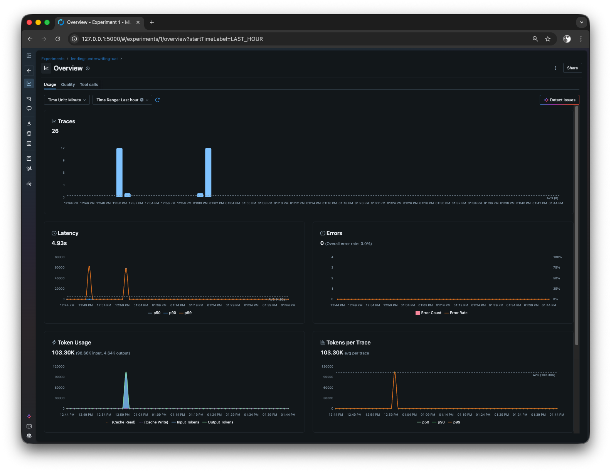
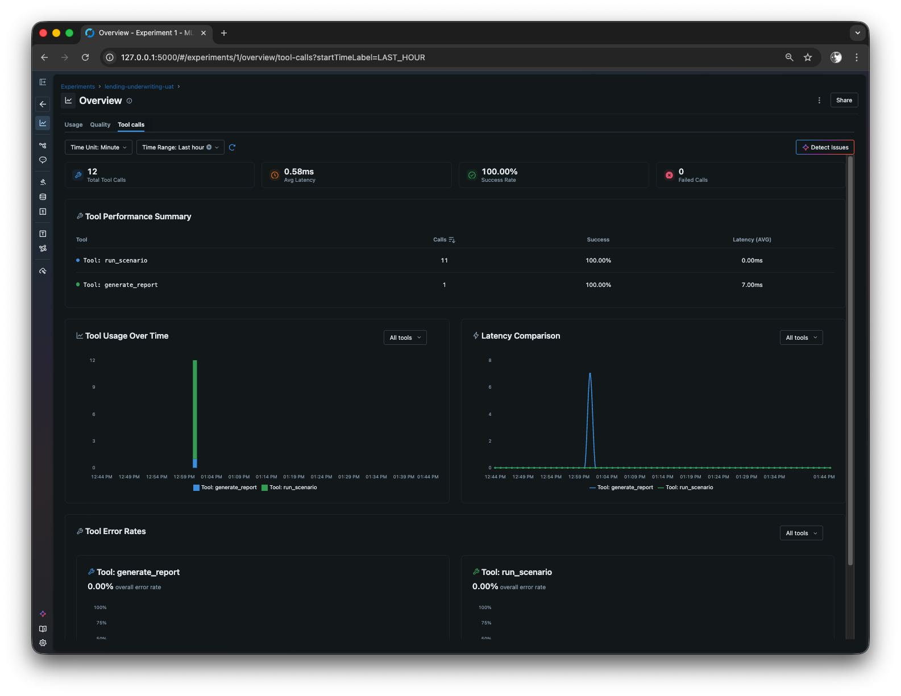

# MLflow Experiment Tracking

MLflow replaces the previous Jaeger/OpenTelemetry integration. It provides:
- **Experiment tracking** — compare pass rates, token usage, and wall-clock time across model runs
- **Artifact logging** — UAT report markdown files are attached to each run
- **Span tracing** — per-tool call timing via MLflow Tracing
- **Run lifecycle** — automatic FAILED status on exceptions

## Quick Start

```bash
# 1. Run the agent with MLflow enabled
uv run python agent.py --model claude-sonnet-4.5 --mlflow

# 2. Open the MLflow UI (in a separate terminal from the repo root)
mlflow ui --backend-store-uri sqlite:///mlruns/mlflow.db
# → http://localhost:5000
```

## UI Overview

**Usage tab** — traces count, latency percentiles, error rate, token usage (input/output/cache), and tokens-per-trace over time:



**Tool calls tab** — per-tool call counts, success rate, avg latency, usage over time, and error rates broken down by tool:



## What Gets Logged

Each `agent.py` invocation with `--mlflow` creates one MLflow **run** under the
`lending-underwriting-uat` experiment.

### Parameters (set at run start)
| Parameter | Example |
|-----------|---------|
| `model` | `claude-sonnet-4.5` |
| `scenarios` | `standard_approval,bonus_income` or `all` |
| `timeout` | `300` |
| `mode` | `sdk` or `manual` |

### Metrics (logged after session completes)
| Metric | Description |
|--------|-------------|
| `pass_count` | Scenarios that passed |
| `fail_count` | Scenarios that failed |
| `pass_rate` | Fraction passed (0.0–1.0) |
| `total_scenarios` | Total scenarios run |
| `api_calls` | Number of LLM API calls |
| `tool_calls` | Number of registered tool executions |
| `input_tokens` | Total input tokens |
| `output_tokens` | Total output tokens |
| `cache_read_tokens` | Tokens served from provider cache |
| `total_tokens` | `input_tokens + output_tokens` |
| `cost_multiplier` | Billing multiplier reported by the SDK |
| `llm_duration_ms` | LLM-reported processing time (ms) |
| `wall_clock_s` | End-to-end wall-clock duration (s) |

### Artifacts
- UAT report markdown (`tests/uat/reports/uat_report_*.md`) attached to the run

### Traces (MLflow Tracing)
- Root span: `UAT Session` — wraps `session.send_and_wait()`
- Child spans: `Tool: run_scenario`, `Tool: generate_report`, etc. (one per tool call)
- Spans visible in the **Traces** tab of the MLflow UI when using MLflow ≥ 2.14

## Comparing Runs

In the MLflow UI at `http://localhost:5000`:

1. Select the `lending-underwriting-uat` experiment
2. Check multiple runs
3. Click **Compare** → view `pass_rate`, `wall_clock_s`, `total_tokens` side-by-side

```bash
# Example: compare claude-sonnet-4.5 vs gpt-4.1
uv run python agent.py --model claude-sonnet-4.5 --mlflow
uv run python agent.py --model gpt-4.1 --mlflow
mlflow ui --backend-store-uri sqlite:///mlruns/mlflow.db
```

## Manual Mode

`--manual` mode also supports `--mlflow`:

```bash
uv run python agent.py --manual --mlflow
```

Logs `pass_rate`, `pass_count`, `fail_count`, `total_scenarios`, and the manual report artifact.

## Storage

Runs are stored locally in `mlruns/mlflow.db` (SQLite, no server needed).
The `mlruns/` directory is git-ignored. The SQLite backend enables the MLflow
**Overview** tab (run comparison charts, metric history, artifact browser).

## Cleanup

```bash
# Remove all local run data
rm -rf mlruns/
```
